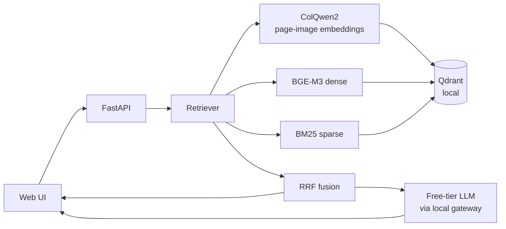

# ColPali RAG - Story Kit

One page of material for the demo poster, slides, and the "so what?" conversation.
Everything here is measured or true of the shipped code (see `evals/baseline.json`).

## Elevator pitch (2 sentences)

> A chat interface that answers questions **from the actual pixels of your PDFs** —
> charts, tables, and figures included — by fusing a vision-language retriever
> (ColQwen2), a dense text model (BGE-M3), and BM25 keyword search. It runs on a
> 6 GB laptop GPU and uses free-tier LLM models through a local gateway.

## What / Why / How / Results

| | |
|---|---|
| **What** | Upload PDFs, ask questions in plain language, get cited answers with page-thumbnail evidence and a live look at *how* retrieval decided. |
| **Why it's different** | Normal "chat with your PDF" tools chunk **text**. Ours renders each page to an image and retrieves on the **image**, so questions whose answers live in a chart, a diagram, or a table cell actually work. |
| **How** | Three independent rankings per query: ColQwen2 via late-interaction MaxSim (each page = a set of patch vectors), BGE-M3 dense, and BM25 sparse. Reciprocal Rank Fusion merges them. Its top pages go to a free-tier LLM that answers **with citations**. |
| **Results** | Dev-set retrieval (10 hand-checked queries): **hit@3/5/10, MRR@10, NDCG@5 = 1.000** for hybrid fusion; all 8 scripted demo questions retrieve their exact page at rank 0, including 3 questions answerable only from chart pixels. |

## Architecture



ASCII sketch (for print):

```
                    ┌──────────┐   ┌────────────┐
  PDF upload ──────▶│ render + │──▶│ embed:     │
                    │ index    │   │ ColQwen2   │──┐
                    └──────────┘   │ BGE-M3     │  │
                                   │ BM25       │──┤
  query ──▶ encode ────────────────┘             ▼
                                            [Qdrant]
                                   three legs ──┐
                                    RRF fusion ◀─┘
                                         │
                     cited answer ◀── free-tier LLM
```

## What to say when they ask

- **"Why not just chunk the text?"** — Chunking destroys charts and tables; the
  answer to "what does the revenue chart show?" is *inside the pixels*. Text
  chunking can't locate it. ColPali compares the question to rendered page
  images, so it can. Text is still used — as a second and third opinion
  (dense + BM25) fused in.
- **"What is late interaction / MaxSim?"** — Each page is embedded as a set of
  patch vectors (like "attention to this region of the page"). The query is
  also a set. We score how well each query patch matches the page's best patch,
  summed up. That's why it can match "green line going up" semantics, not just
  words.
- **"Why three retrievers?"** — Each leg is good at different things: ColQwen2
  for visual layout, BGE for paraphrase, BM25 for exact terms (model names,
  error codes, `L-77-PING`). RRF (Reciprocal Rank Fusion) is a proven, cheap,
  parameter-light way to merge rankings by position rather than by score scale.
- **"What's the LLM?"** — A free model served through a local gateway
  (OmniRoute). If the gateway is unreachable, the app degrades to extractive
  answers — verbatim quotes from the retrieved pages — and says so in the UI.
  The demo never dies on network flakiness.
- **"How big is this?"** — Runs on a 6 GB RTX 3050 laptop: page rendering +
  ColQwen2 + BGE-M3 + BM25, all local. Only the answer-generation is remote,
  and that part is optional.
- **"How do you know it works?"** — A dev set of hand-checked queries with
  gold (source, page) labels; metrics computed by the repo's own eval harness
  (hit@k, MRR@10, NDCG@5) — see `evals/golden_queries.json` and
  `evals/baseline.json`. Plus a scripted 8-question demo pack where every
  question retrieves its exact page at rank 0 (`demo/README.md`).

## Poster bullets

- Vision-first retrieval (ColQwen2, late-interaction MaxSim) + BGE-M3 + BM25,
  fused with Reciprocal Rank Fusion.
- Answers with citations and page-thumbnail evidence; UI shows the fusion
  internals live.
- Retrieval metrics: MRR@10 = 1.0, NDCG@5 = 1.0 on the dev set; 8/8 demo
  questions rank-0 including chart-only questions.
- 6 GB GPU, free-tier LLM via local gateway, graceful offline degradation.
- Tested: 32 passing tests; retrieval re-verified after every fusion change.

## Honest limits (have these ready)

- Small dev set (10 queries) — absolute scores are optimistic; the harness is
  built to grow it to 30-100.
- The LLM answers are free-tier quality; falls back to extractive when offline.
- Qdrant runs local single-writer: one ingest at a time (the API serializes it).